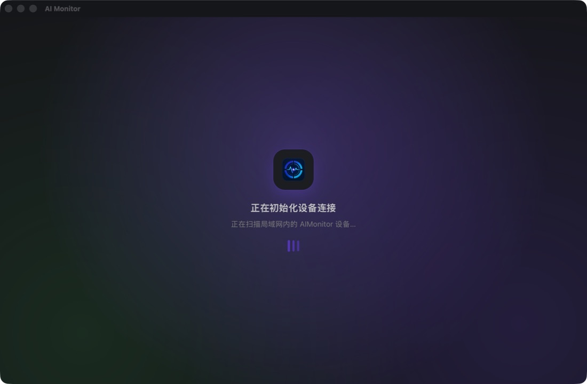
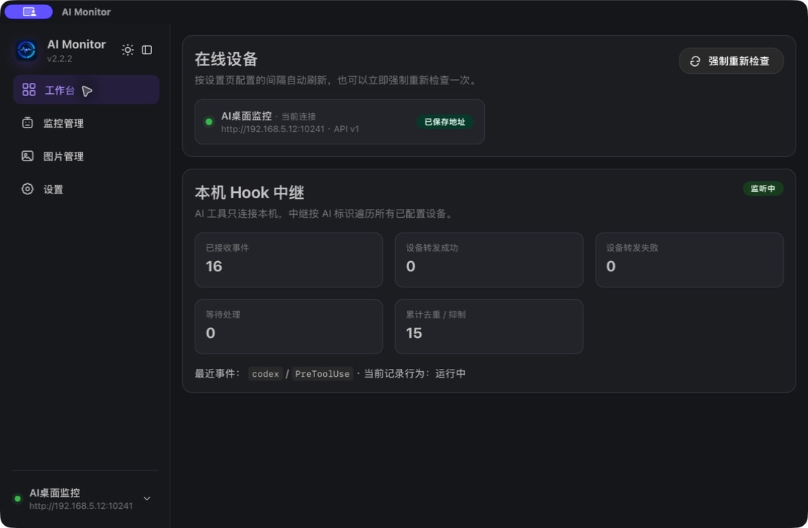
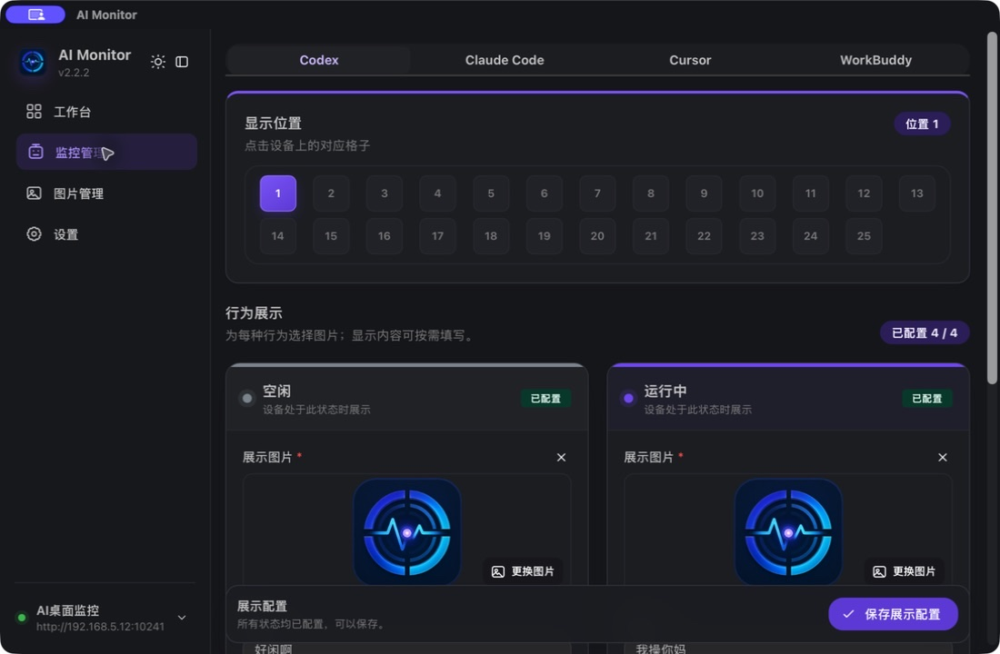
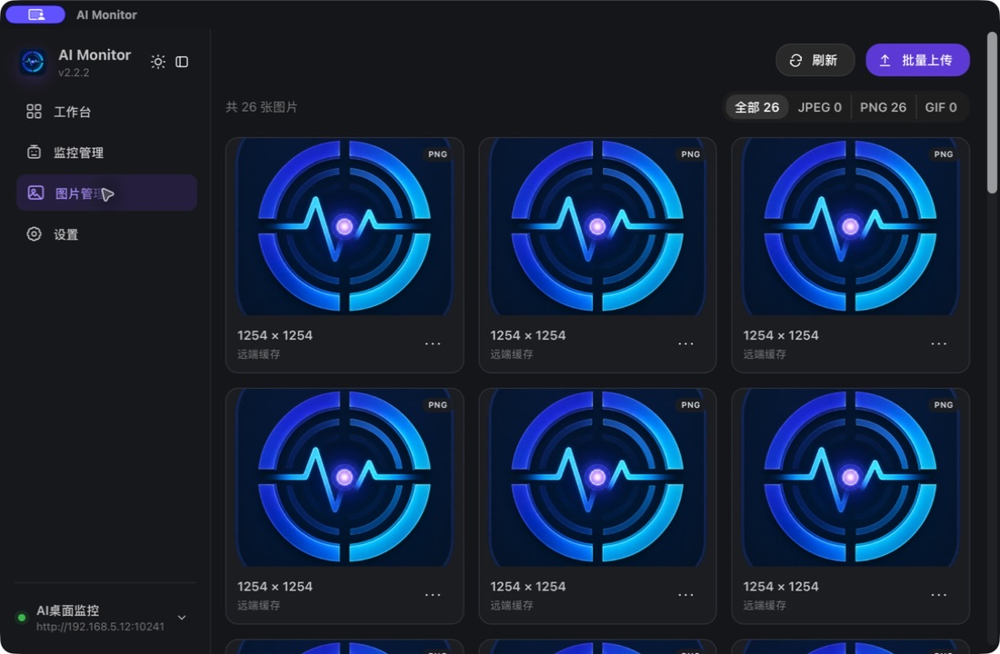
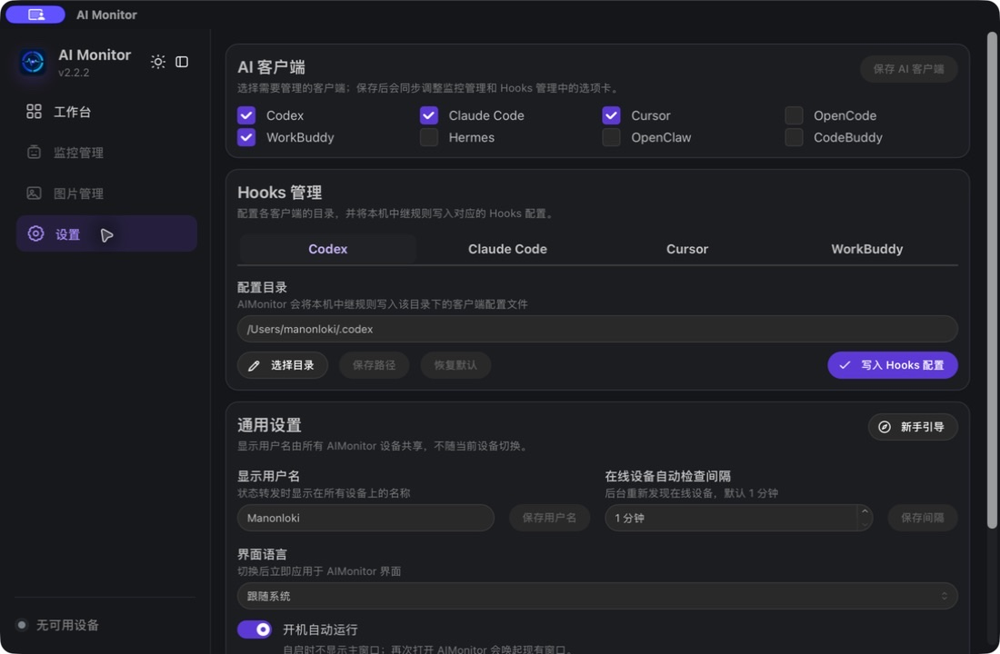
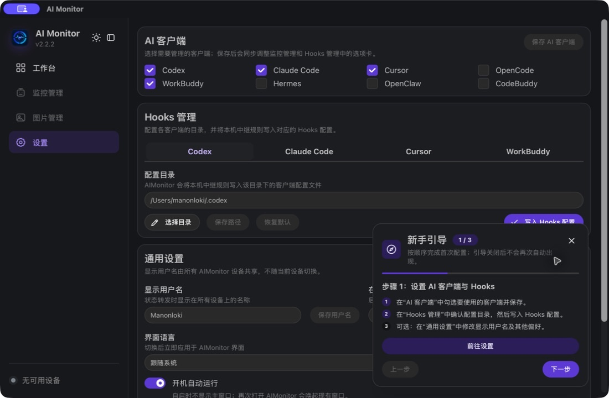

# AIMonitor Setup

**English** | [简体中文](README_zh.md)

AIMonitor Setup is the desktop configuration and relay application for AIMonitor
devices. It discovers AIMonitor devices on the local network, manages per-client
display positions, state images, and Hooks, and forwards local events from Codex,
Claude Code, Cursor, OpenCode, WorkBuddy, Hermes, OpenClaw, and CodeBuddy to every
configured online device.

The project is built with Tauri and React. Rust is the sole business backend;
React is limited to presentation, interaction, and typed Tauri command calls.

## Features

- Discover local AIMonitor devices through mDNS and UDP broadcast, then keep their
  online state refreshed in the background.
- Configure any of 25 display positions and four states—idle, running, asking,
  and error—separately for each device and AI client.
- Browse, filter, batch upload, and manage JPEG, PNG, GIF, BMP, and WebP images.
  The Rust backend validates, resizes, and converts images for device compatibility.
- Write local relay configuration for supported AI clients. Command Hooks use
  AIMonitor's lightweight relay mode and do not depend on PowerShell on Windows.
- Inspect online devices and local relay metrics, including received, forwarded,
  failed, pending, deduplicated, and suppressed events.
- Use the interface in English or Simplified Chinese, run silently at startup,
  control the app from the system tray, switch between devices, and follow the
  first-run guide.

## Screenshots

The following screenshots were captured from AIMonitor v2.2.2 on macOS and match
the current repository version.

### Startup and device discovery

At startup, AIMonitor checks available devices through mDNS, UDP broadcast, and
previously saved addresses.



### Workbench

The workbench shows online devices and the local Hook relay's received, forwarded,
failed, pending, and suppressed event counts.



### Monitor management

Display positions and all four behavior states are stored independently for each
device and AI client.



### Image management

Review image totals and formats, refresh or filter the list, and upload multiple
images at once.



### Settings

Choose AI clients, manage Hook configuration directories, set the shared display
name and discovery interval, select a language, and configure launch at startup.



### Getting started

The first-run guide walks through AI client selection, Hook setup, image upload,
and display configuration.



## Development

Requirements:

- Node.js 22.12+
- pnpm 10.30+
- Rust stable (currently verified with 1.97)
- The Tauri system dependencies for your target platform

Install dependencies and start the development application:

```bash
pnpm install
pnpm tauri dev
```

Common checks:

```bash
pnpm build
pnpm check
pnpm tauri build
```

## Release builds (maintainer guide)

The release workflow uses the same commands, platform labels, and artifact naming
conventions as AIMonitorDesktop. A macOS package is copied to `publish/` only
after Developer ID signing, notarization, ticket stapling, and Gatekeeper
validation all succeed.

### One-time build machine setup

Install project dependencies, Rust targets, and the Windows cross-compilation
tools:

```bash
pnpm install
rustup target add aarch64-apple-darwin x86_64-apple-darwin
rustup target add x86_64-pc-windows-msvc
brew install llvm nsis
cargo install --locked cargo-xwin
```

The macOS keychain must contain a valid `Developer ID Application` certificate
and its private key:

```bash
security find-identity -v -p codesigning
```

Create an App Store Connect API key with Developer access, save the downloaded
`.p8` key in a secure local directory, and store the notarization credentials in
the keychain. Replace every placeholder before running these commands:

```bash
mkdir -p "$HOME/.appstoreconnect/private_keys"
chmod 700 "$HOME/.appstoreconnect/private_keys"
chmod 600 "$HOME/.appstoreconnect/private_keys/AuthKey_<KEY_ID>.p8"

xcrun notarytool store-credentials AIMonitorNotary \
  --key "$HOME/.appstoreconnect/private_keys/AuthKey_<KEY_ID>.p8" \
  --key-id "<KEY_ID>" \
  --issuer "<ISSUER_ID>"
```

Verify the stored credentials:

```bash
xcrun notarytool history --keychain-profile AIMonitorNotary
```

Never commit the certificate, its private key, the App Store Connect API key, the
`.p8` file, or the Issuer ID. Set `AIMONITOR_NOTARY_PROFILE` before building if
you use a different keychain profile name.

### Building a release

1. Update the version in `package.json`, `src-tauri/Cargo.toml`, and
   `src-tauri/tauri.conf.json`. All three values must match.
2. Run the pre-release checks:

   ```bash
   pnpm build
   pnpm check
   ```

3. Choose a target:

   ```bash
   # macOS universal binary (Apple Silicon + Intel)
   pnpm run build:mac

   # Windows x64 through cargo-xwin on macOS/Linux
   pnpm run build:win

   # Build macOS universal and Windows x64 in sequence
   pnpm run build:release
   ```

   To build a single macOS architecture, override the default target:

   ```bash
   AIMONITOR_MAC_TARGET=aarch64-apple-darwin pnpm run build:mac
   AIMONITOR_MAC_TARGET=x86_64-apple-darwin pnpm run build:mac
   ```

4. After a successful build, inspect `publish/`:

   - `AIMonitorSetup-macOS-<architecture>-v<version>.dmg`
   - `AIMonitorSetup-Windows-x64-v<version>-setup.exe`
   - `AIMonitorSetup-SHA256SUMS.txt`

The release script clears and repopulates `publish/` only after every requested
platform succeeds, so it does not publish partial output. The automated macOS
flow is: Tauri build and signing → DMG signature validation → Apple notarization
and wait for `Accepted` → staple the ticket → Gatekeeper validation → copy the
installer.

The Windows x64 installer is built through `cargo-xwin` and NSIS with `--no-sign`;
it does not have an Authenticode signature. Windows signing and macOS Developer
ID signing/notarization are independent processes.

### Post-release validation

Replace the version in each filename with the actual release version:

```bash
xcrun stapler validate "publish/AIMonitorSetup-macOS-<architecture>-v<version>.dmg"
spctl --assess --verbose=2 --type open \
  --context context:primary-signature \
  "publish/AIMonitorSetup-macOS-<architecture>-v<version>.dmg"
shasum -a 256 -c publish/AIMonitorSetup-SHA256SUMS.txt
```

`stapler validate` must succeed, and `spctl` must report `accepted` and
`source=Notarized Developer ID`. Finally, test installation and first launch on
another Mac and on a Windows machine.

### Moving to a new machine or rotating keys

A new build machine needs both the Developer ID certificate with its private key
and the App Store Connect `.p8` key. After importing the signing certificate,
run `notarytool store-credentials` again. Revoke the old API key in App Store
Connect only after the new setup can build and notarize successfully.

### Troubleshooting

- Signing identity not found: confirm that both the certificate and its private
  key are present in the keychain, then run
  `security find-identity -v -p codesigning`.
- `AIMonitorNotary` not found: run `notarytool store-credentials` again or set
  `AIMONITOR_NOTARY_PROFILE` to the correct profile.
- Notarization returns `Invalid`: obtain the Submission ID from the build output,
  then run
  `xcrun notarytool log <SUBMISSION_ID> --keychain-profile AIMonitorNotary`.
- Windows build tools missing: confirm that `cargo-xwin`, `makensis`, and LLVM
  are installed and that `llvm-rc` is on `PATH`.
- Gatekeeper blocks the DMG: do not bypass the warning and publish it. Confirm
  that `stapler validate` succeeds and `spctl` reports
  `Notarized Developer ID`.

## Project rules

- [Technology stack and versions](docs/technology-stack.md)
- [Architecture and code boundaries](docs/architecture.md)
- [Hooks contract](docs/hooks-contract.md)
- [Agent collaboration rules](AGENTS.md)

## License

The source code is provided under the
[PolyForm Noncommercial License 1.0.0](LICENSE). It may be used, modified, and
distributed for personal, research, educational, and other noncommercial
purposes allowed by the license. Commercial use requires separate written
permission from the copyright holder.

Because the license restricts commercial use, this project is source-available
rather than open source under the OSI definition.
